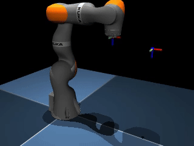
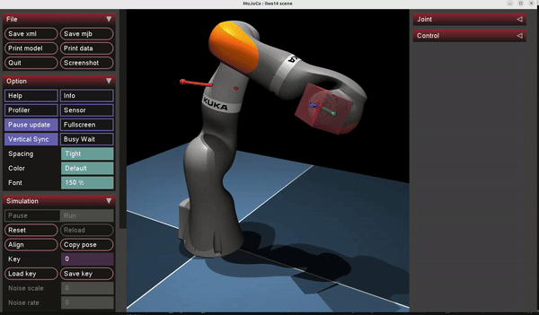

# Mujoco Tutorials
Welcome to the Mujoco Simulations Tutorials! These tutorials cover a variety of common robotics tasks and controllers, providing a comprehensive introduction to using Mujoco for robotics simulation. Each tutorial is designed to be self-contained within a single file for ease of use and understanding.
## Installation
TODO

## Main content
Below is the main content of this tutorial. It is recommended to follow the order of the content to get familiar with Mujoco, as the tutorial is sequentially designed.
| File | Descriptions | Demos |
|------|--------------|-------|
|[mujoco_basic.ipynb](./mujoco_basic.ipynb)| This notebook contains the basic Mujoco concepts, including model description, Mujoco data structure, rendering, etc. Several advanced visualization tricks will be covered. By the end of this tutorial, we will build a dominoes example.||
|[robot_arms.ipynb](./robot_arms.ipynb) | This notebook starts the model-based controller design with Mujoco through several manipulation tasks. Differential inverse kinematics and operational space control will be covered. The robot being used includes UR5E, Panda and Kuka||
|[robot_arm_mocap](./robot_arm_mocap.py)|This python file is a extension of [robot_arms.ipynb](./robot_arms.ipynb). Here we demonstrate how interatct with Mujoco embed GUI and intereact with our robot through mocap.|| 

## References
The codes in these tutorials are heavily based on several online Mujoco tutorials, controller implementations, and robotics books. Below is a table listing the references used:
| Reference | Origin Author(s) | Descriptions |
|-----------|------------------|--------------|
|[Mujoco Official tutorials](https://github.com/google-deepmind/mujoco)|Deepmind|Official Mujoco tutorials from Deepmind.|
|[Mjctrl](https://github.com/kevinzakka/mjctrl)|Kevin Zakka|Single-file implementations of common robotics controllers in MuJoCo. Our robot aram tutorial mainly based on his repo|